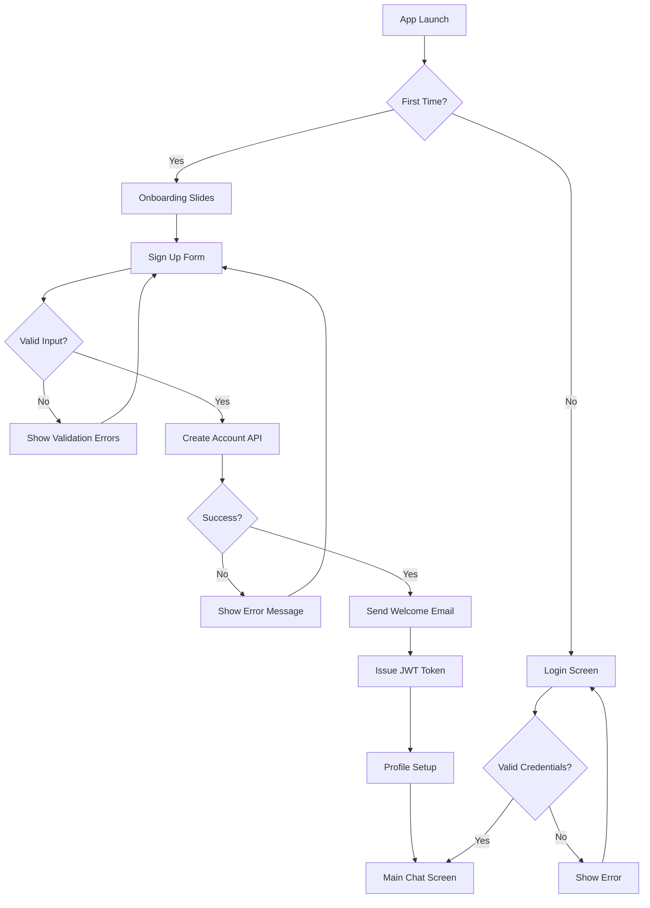
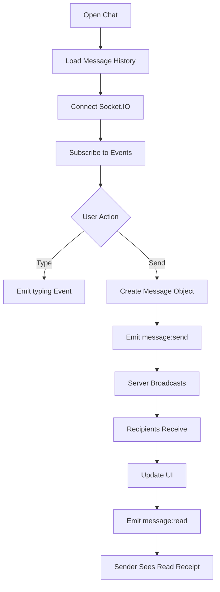

# Product Requirements Document (PRD)
## NexusChat - Real-Time Messaging Application

---

## 1. Executive Summary

**NexusChat** is a premium, next-generation real-time messaging application designed to break away from the conventional chat app aesthetic. Built with Flutter for cross-platform mobile excellence and powered by a Node.js/MongoDB backend, NexusChat delivers instant messaging with a visually stunning, futuristic interface that feels expensive and delightful to use.

### Vision Statement
> "Communication reimagined through bold design and seamless technology."

### Target Platforms
- **iOS** (iOS 12+)
- **Android** (API 21+)

---

## 2. Problem Statement

Current messaging applications suffer from:
- **Visual Monotony**: WhatsApp, Telegram, and others share nearly identical UI patterns
- **Lack of Personality**: Generic color schemes and uninspired interfaces
- **Missing Delight**: No micro-interactions or animations that make the app enjoyable
- **Poor Differentiation**: Users can barely tell apps apart

### Our Solution
A messaging platform that prioritizes **premium aesthetics**, **fluid interactions**, and **modern design language** while maintaining robust real-time communication capabilities.

---

## 3. User Personas

### Primary Persona: "The Design Enthusiast"
- **Age**: 18-35
- **Traits**: Values aesthetics, early adopter, shares beautiful content
- **Pain Points**: Bored with generic chat apps, wants to stand out
- **Goals**: Use an app that reflects their taste and personality

### Secondary Persona: "The Professional"
- **Age**: 25-45
- **Traits**: Efficiency-focused, appreciates polish, uses multiple communication tools
- **Pain Points**: Apps feel cluttered or outdated
- **Goals**: Clean, professional communication with style

---

## 4. Core Features

### 4.1 Authentication System

#### Sign Up Flow
```
┌─────────────────────────────────────────────────────────┐
│  User opens app → Animated splash screen                │
│       ↓                                                 │
│  Onboarding slides (3 screens with parallax)            │
│       ↓                                                 │
│  Sign Up form (email, password, username)               │
│       ↓                                                 │
│  JWT token issued → Automatic welcome email             │
│       ↓                                                 │
│  Profile setup (avatar, bio, status)                    │
│       ↓                                                 │
│  Main chat screen                                       │
└─────────────────────────────────────────────────────────┘
```

| Feature | Description | Priority |
|---------|-------------|----------|
| Email/Password Registration | Secure account creation with validation | P0 |
| Welcome Email | Automatic SendGrid/Nodemailer integration | P0 |
| JWT Authentication | Stateless, secure token-based auth | P0 |
| Password Recovery | Email-based reset flow | P1 |
| Session Management | Multi-device support with logout all | P1 |

#### User Stories - Authentication
- **US-001**: As a new user, I want to sign up with my email so I can create an account
- **US-002**: As a registered user, I want to receive a welcome email confirming my registration
- **US-003**: As a user, I want to reset my password via email if I forget it
- **US-004**: As a user, I want to stay logged in across app restarts

---

### 4.2 Real-Time Messaging

#### Message Types
| Type | Format | Features |
|------|--------|----------|
| Text | Plain/Rich | Emoji support, link previews |
| Image | JPEG/PNG/GIF | Compression, thumbnails |
| Voice | Audio clips | Waveform visualization |
| File | Any format | Size limit: 25MB |

#### Real-Time Features
```
┌────────────────────────────────────────────────────┐
│                  SOCKET.IO EVENTS                  │
├────────────────────────────────────────────────────┤
│  message:send      → New message dispatched        │
│  message:received  → Message delivered to server   │
│  message:read      → Message seen by recipient     │
│  user:typing       → Typing indicator active       │
│  user:online       → Presence status update        │
│  user:offline      → User disconnected             │
└────────────────────────────────────────────────────┘
```

#### Message Status Flow
```
┌──────┐    ┌───────────┐    ┌──────────┐    ┌──────┐
│ Sent │ →  │ Delivered │ →  │   Read   │    │Failed│
│  ○   │    │    ○○     │    │   ○○✓    │    │  ⚠   │
└──────┘    └───────────┘    └──────────┘    └──────┘
```

#### User Stories - Messaging
- **US-010**: As a user, I want to send instant messages to my contacts
- **US-011**: As a user, I want to see when my messages are delivered and read
- **US-012**: As a user, I want to see when someone is typing a message
- **US-013**: As a user, I want to see online/offline status of my contacts
- **US-014**: As a user, I want messages to sync across my devices

---

### 4.3 Social & Contacts

#### Profile Customization
| Element | Description | Constraints |
|---------|-------------|-------------|
| Avatar | Profile picture | 500x500px max, 2MB |
| Username | Unique identifier | 3-20 chars, alphanumeric |
| Display Name | Shown in chats | 1-50 chars |
| Bio | Personal description | 0-150 chars |
| Status | Quick mood/update | 0-50 chars |

#### Contact Management
```
┌─────────────────────────────────────────────────┐
│              CONTACT ACTIONS                     │
├─────────────────────────────────────────────────┤
│  🔍 Search by email or username                  │
│  ➕ Send friend/contact request                  │
│  ✓  Accept incoming requests                     │
│  ✗  Decline/Remove contact                       │
│  🚫 Block user                                   │
│  ✓  Unblock user                                 │
└─────────────────────────────────────────────────┘
```

#### User Stories - Social
- **US-020**: As a user, I want to customize my profile with an avatar and bio
- **US-021**: As a user, I want to search and add friends by email or username
- **US-022**: As a user, I want to block users who harass me
- **US-023**: As a user, I want to see my contact list organized alphabetically
- **US-024**: As a user, I want to update my status message

---

## 5. User Flows

### 5.1 Complete Registration Flow


### 5.2 Messaging Flow


---

## 6. Non-Functional Requirements

### 6.1 Performance
| Metric | Target | Notes |
|--------|--------|-------|
| App Cold Start | < 2 seconds | Local cache for instant display |
| Message List Load | < 100ms | Cursor pagination + local cache |
| Message Send (Perceived) | < 100ms | Optimistic updates |
| Message Delivery (Actual) | < 500ms | Queue-based processing |
| Image Upload | < 3 seconds | Client-side compression |
| Search Response | < 200ms | Compound indexes |
| Animation FPS | 60fps minimum | Hardware acceleration |
| API Response (P95) | < 300ms | Gzip compression |

### 6.2 Security
- **Password Hashing**: bcrypt with 12 salt rounds
- **JWT Expiry**: Access token: 15 min, Refresh token: 7 days
- **HTTPS Only**: TLS 1.3 mandatory
- **Input Sanitization**: Zod validation + XSS prevention
- **Rate Limiting**: Tiered (100/min standard, 5/15min auth, 30/sec messaging)
- **Request Signing**: HMAC signature for API requests

### 6.3 Scalability
- Horizontal scaling via Docker + Kubernetes
- MongoDB replica sets (1 primary + 2 read replicas)
- Redis cluster (separate for Queue, Pub/Sub, Cache)
- Socket.IO with sticky sessions + Redis adapter
- CloudFront CDN for media delivery
- BullMQ for message queue reliability

### 6.4 Reliability
- **Uptime Target**: 99.9% (< 8.76 hours downtime/year)
- **Message Delivery**: 99.99% with queue + retry logic
- **Offline Support**: Local message queue with sync on reconnect
- **Data Backup**: Hourly incremental, daily full backups
- **Message Archiving**: Auto-archive after 1 year

---

## 7. Success Metrics

### Key Performance Indicators (KPIs)
| Metric | Target | Measurement |
|--------|--------|-------------|
| User Registration Rate | 1000+ users/month | Analytics |
| Daily Active Users (DAU) | 30% of total users | Firebase/Analytics |
| Message Delivery Success | 99.5%+ | Server logs |
| App Store Rating | 4.5+ stars | Store reviews |
| User Retention (D7) | 40%+ | Cohort analysis |
| Crash-Free Rate | 99.9%+ | Crashlytics |

---

## 8. Technical Stack Summary

| Layer | Technology | Purpose |
|-------|------------|---------|
| Mobile Frontend | Flutter 3.x (Dart) | Cross-platform UI |
| State Management | Riverpod/BLoC | Reactive state |
| Backend API | Node.js + Express.js | REST endpoints |
| Real-time | Socket.IO | WebSocket management |
| Database | MongoDB | Document storage |
| Cache | Redis | Session/Socket state |
| Email | SendGrid/Nodemailer | Transactional emails |
| Push Notifications | FCM/APNs | Message alerts |

---

## 9. Out of Scope (v1.0)

The following features are deferred to future releases:
- ❌ Group chats (v2.0)
- ❌ Voice/Video calls (v2.0)
- ❌ End-to-end encryption (v2.0)
- ❌ Stories/Status updates (v2.0)
- ❌ Message reactions (v1.5)
- ❌ Stickers/GIF keyboard (v1.5)

---

## 10. Risk Assessment

| Risk | Impact | Probability | Mitigation |
|------|--------|-------------|------------|
| Socket.IO scaling issues | High | Medium | Redis adapter, load testing |
| MongoDB performance | Medium | Low | Proper indexing, sharding plan |
| iOS App Store rejection | High | Low | Follow Apple guidelines strictly |
| User data breach | Critical | Low | Security audits, encryption |
| Poor design execution | High | Medium | Iterative design reviews |

---

## 11. Approval & Sign-off

| Role | Name | Date | Signature |
|------|------|------|-----------|
| Product Owner | | | |
| Tech Lead | | | |
| Design Lead | | | |

---

*Document Version: 1.0*  
*Last Updated: January 3, 2026*
